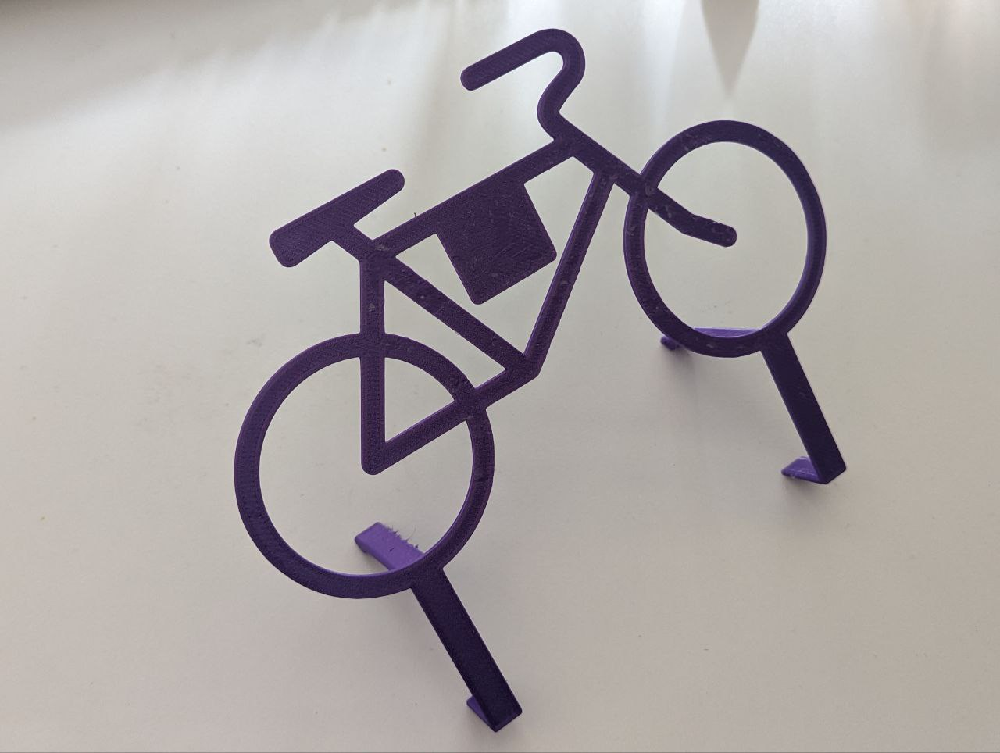
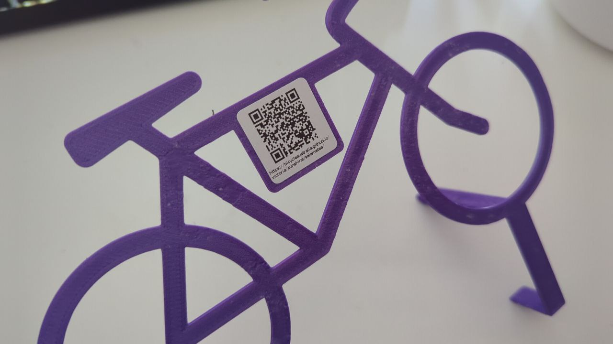

# bicycleaustralia.github.io

The idea of this github page based io is to be a simple community based QR code based landing pages to be placed at common locations like cafes etc... with quick links and local tips and tricks about the area (e.g. Bicycle paths etc...)

## Bicycle Symbol Marker

This repository has a folder with both 2D and 3D markers that can be used to mark locations as a friendly bicycle parking location.
All these are placed in `./marker/` folder

### 3D Printed Bicycle Symbol Marker

In `./marker/3d_print/outdoor_bicycle_symbol_marker` folder is source code to create this 3D printed marker

Originally this was created for a cafe to mark a fenced off area of the cafe as bicycle parking friendly.
The middle of the 3D printed marker has a spot for a QR code sticker to be placed as in the image shown below.

Note that this does not mean there is any assurance of security against bicycle theft. But typically if used in a cafe location internal fenced off area, it's should still be relatively safe even if just the wheel is locked, since people visiting cafe will likely have sight line to the bicycle anyway. Markers should be used responsibly, if in a high crime area or a location where it will be unattended for long period of time... then you want to add a bicycle rack at least.

----

Source of linktree style pages : https://github.com/johnggli/linktree

